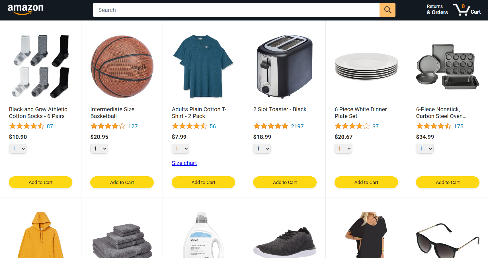
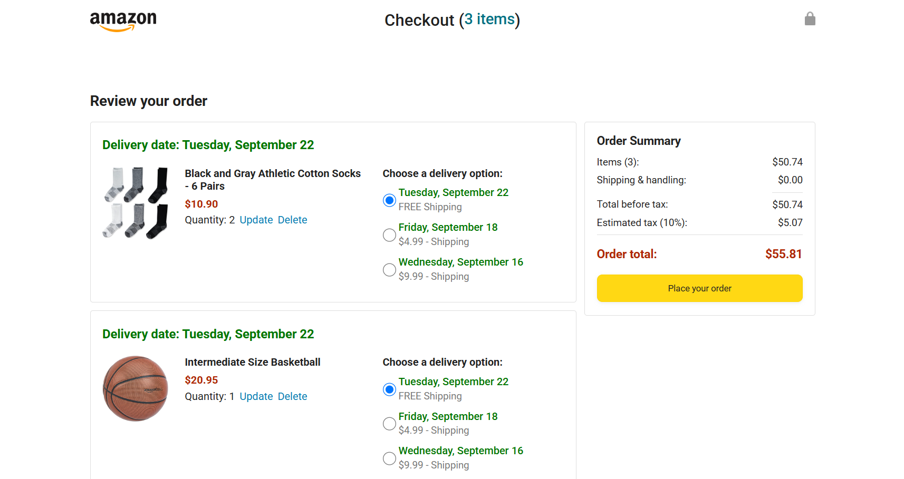
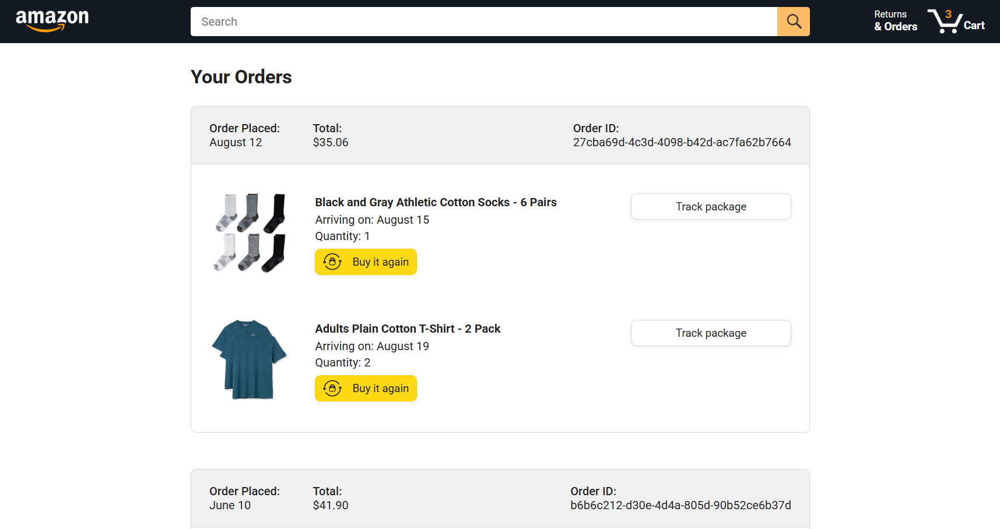
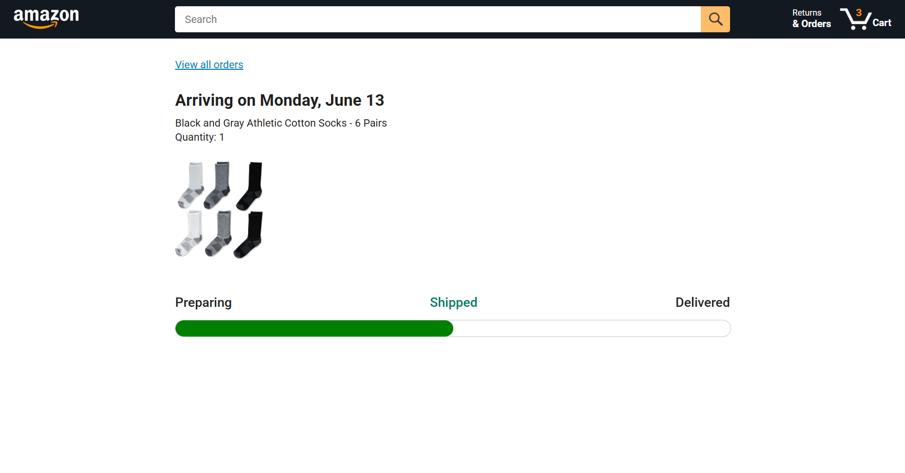

# Amazon Clone (JavaScript)

A front-end recreation of core Amazon interface functionality, built as a self-directed training project to practice JavaScript fundamentals.

## About

This project was built in 2023 while I was self-teaching front-end development, before starting my professional design career. The goal was to practice JavaScript logic and interactivity on top of a real, familiar interface — going beyond static HTML/CSS into dynamic, functional front-end behavior.

## What I practiced

- DOM manipulation
- JavaScript event handling
- Building interactive UI logic (e.g. cart behavior, dynamic content updates)
- Structuring a multi-page or multi-component front-end project

## Note

This is a personal training exercise, not an official or commercial product. It is not affiliated with, endorsed by, or connected to Amazon in any way. Built for learning purposes only.
